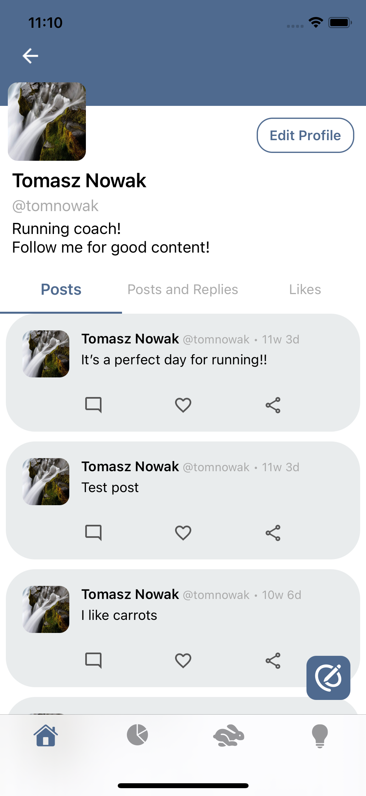
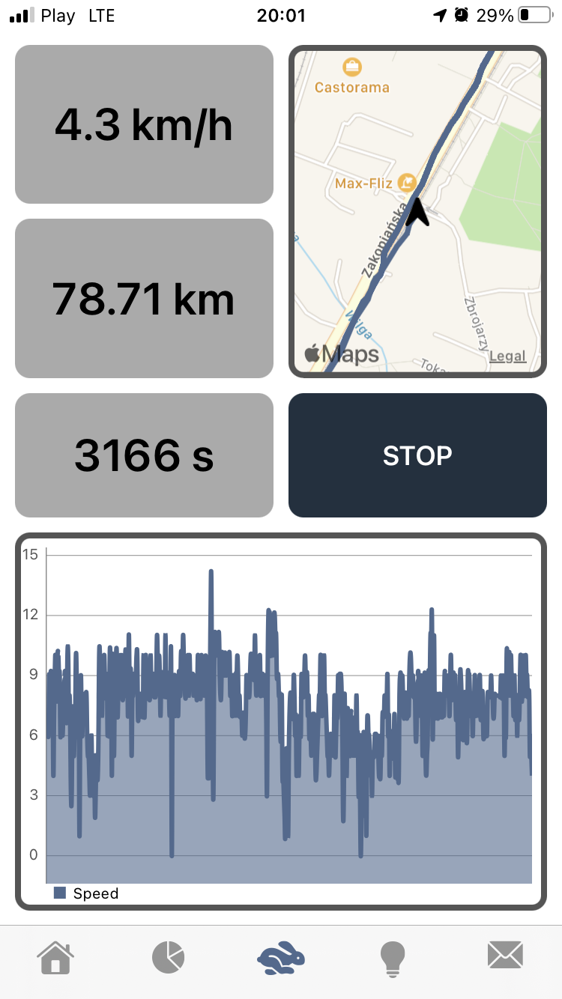
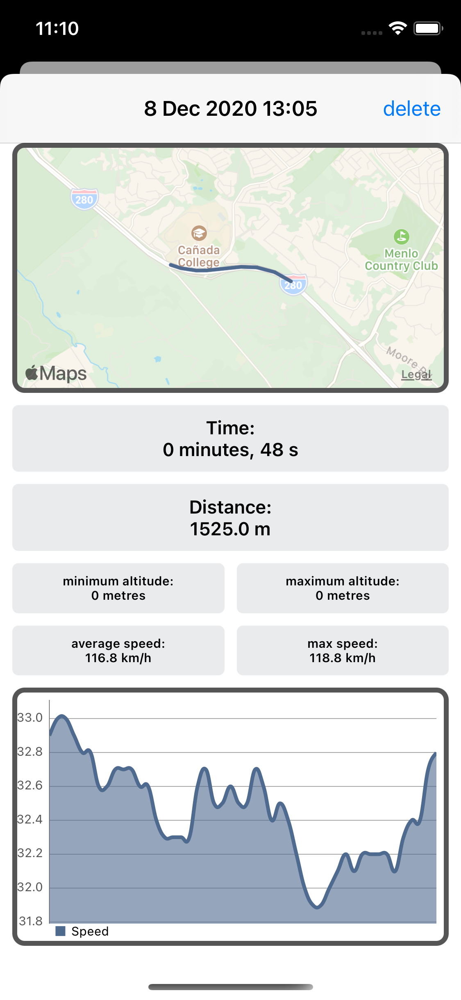
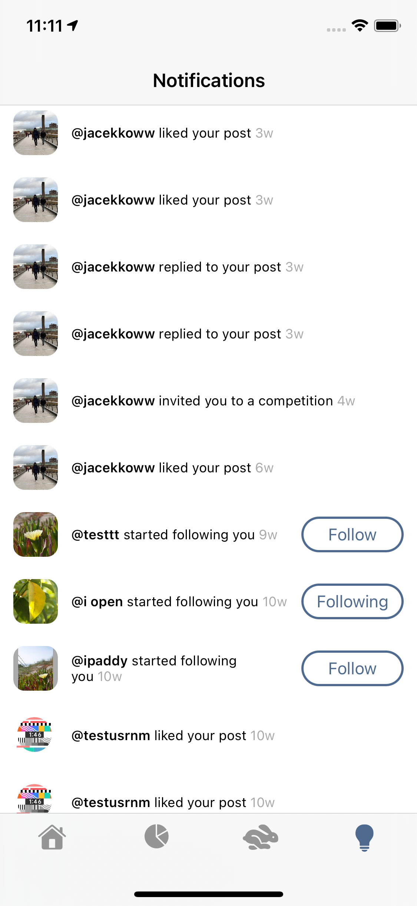
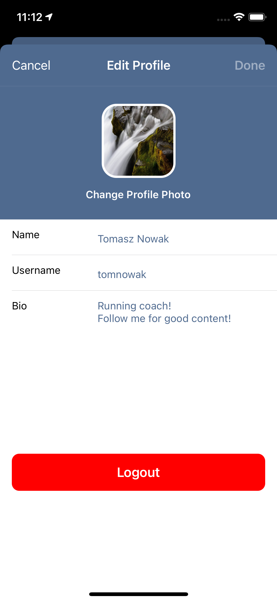
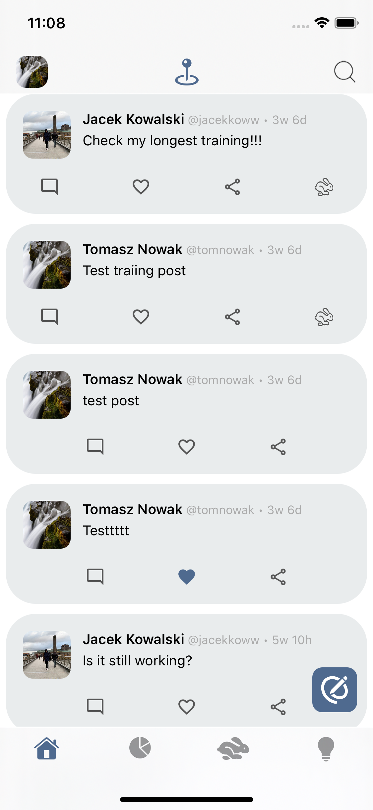
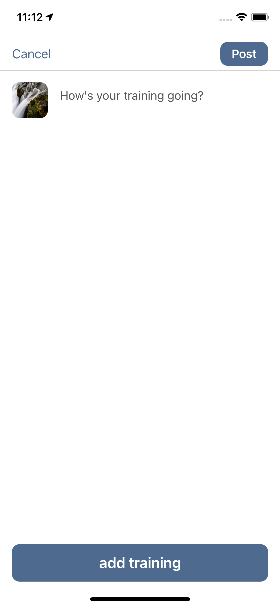
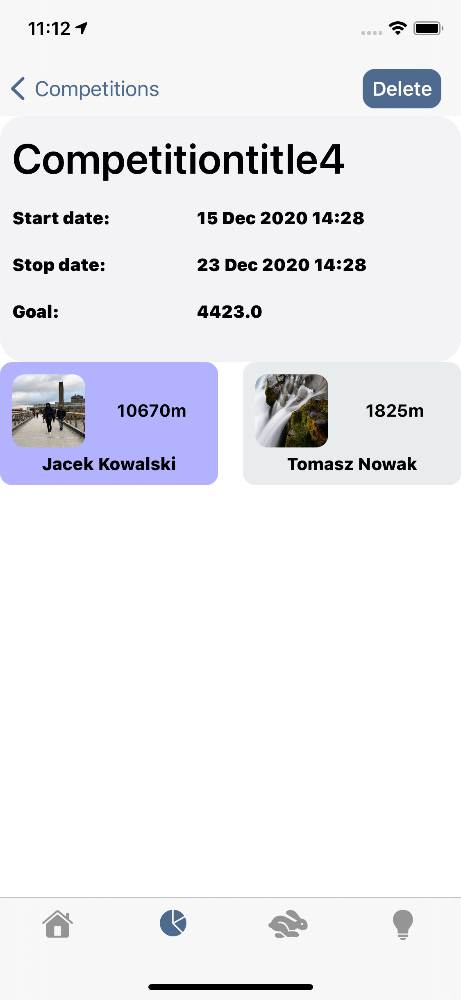

# RunnersAppPt-1

Application for running, sharing progress and competing with friends.

## Table of contents
* [Technologies](#Technologies)
* [Scenes_Preview](#Scenes_Preview)

## Technologies

* UIKit
* MVVM
* CocoaPods 
  - SDWebImage
  - FloatingPanel
* Firebase
  - Authentication
  - Storage
  - Realtime Database

## Scenes_Preview

 
 
